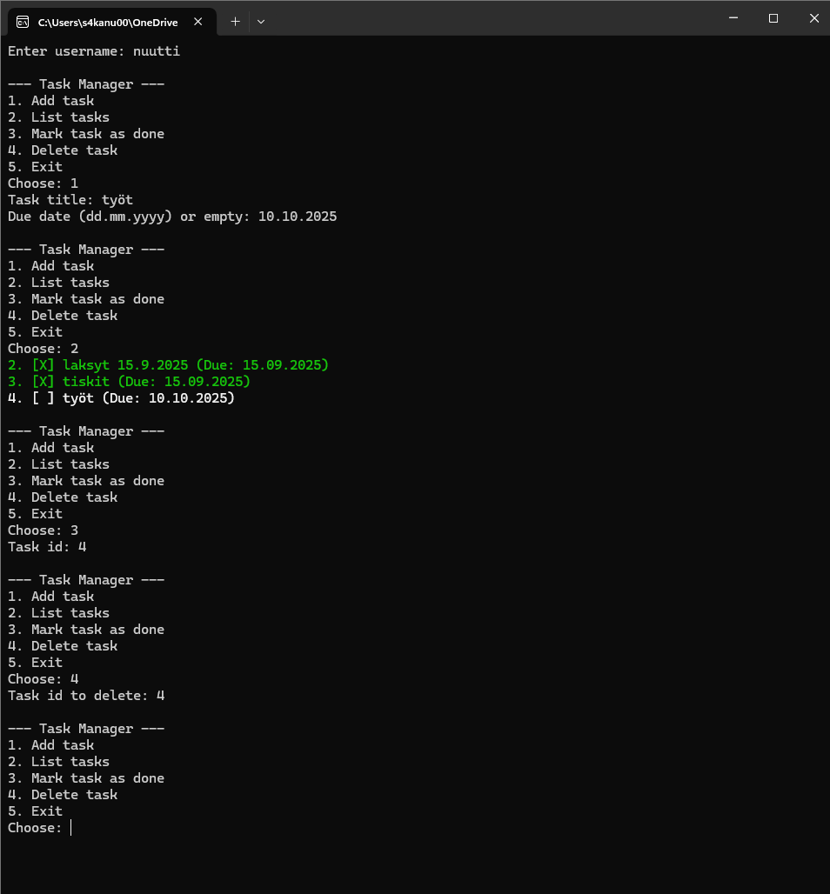

# SimpleTaskManager

## Description
SimpleTaskManager is a C# console application for managing personal tasks.  
The program allows users to:
- Add tasks (with optional due dates)
- List tasks with color-coded status
- Mark tasks as done
- Delete tasks
- Save and load tasks automatically from a **user-specific file**

---

## Features
- Console-based user interface
- Data persistence (tasks are saved to `<username>_tasks.txt`)
- Multiple users supported (each has their own task file)
- Color-coded task list:
  - ✅ Green = Done
  - ⚠️ Red = Overdue
  - ⚪ White = Pending
- Stable, structured, and extendable design

---

## Screenshots



---

## Flowchart

```mermaid
flowchart TD

    A[Start] --> B[Enter username]
    B --> C[Load tasks from file]

    C --> D[Show menu]
    D -->|1. Add task| E[Enter title & due date]
    E --> F[Save task to file] --> D

    D -->|2. List tasks| G[List all tasks with colors] --> D

    D -->|3. Mark task as done| H[Enter task id]
    H --> I[Update task status & save] --> D

    D -->|4. Delete task| J[Enter task id]
    J --> K[Remove task & save] --> D

    D -->|5. Exit| L[End]

    
     Key Parts of the Code
TaskItem.cs
public class TaskItem
{
    public int Id { get; set; }
    public string Title { get; set; }
    public bool Done { get; set; }
    public DateTime? DueDate { get; set; }

    public override string ToString()
    {
        string status = Done ? "[X]" : "[ ]";
        string due = DueDate.HasValue ? $" (Due: {DueDate.Value:dd.MM.yyyy})" : "";
        return $"{Id}. {status} {Title}{due}";
    }
}

TaskService.cs (core logic)

Loads and saves tasks from file

Handles Add, List, MarkDone, Delete

User-specific storage

ConsoleUi.cs (user interface)

Provides menu for user

Reads input

Calls service functions


How to Run

Clone repository

Open in Visual Studio

Run project

Enter a username (tasks saved to <username>_tasks.txt)

Use the menu to manage tasks


Future Improvements

Support for priorities (High / Medium / Low)

Search and filter tasks

Export tasks to PDF/CSV

GUI version with Windows Forms or WPF

Notifications for overdue tasks