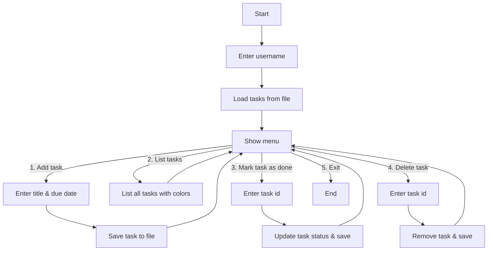

# suomeksi

# SimpleTaskManager

## Selvitys sovelluksen toiminnasta ja käyttötarkoituksesta

**SimpleTaskManager** on C#:lla toteutettu konsolisovellus henkilökohtaisten tehtävien hallintaan.  
Sovelluksen avulla käyttäjä voi:
- Lisätä tehtäviä (halutessaan määräpäivän kera)
- Listata tehtävät värikoodatulla tilalla (tehty, myöhässä, kesken)
- Merkitä tehtäviä tehdyiksi
- Poistaa tehtäviä
- Tallentaa ja ladata tehtävät automaattisesti käyttäjäkohtaisesta tiedostosta (`<käyttäjänimi>_tasks.txt`)

Sovellus tukee useita käyttäjiä – jokaiselle tallennetaan omat tehtävätiedot.  
Tarkoituksena on tarjota helppo ja selkeä työkalu omien tehtävien hallintaan ilman ylimääräisiä asennuksia tai monimutkaisia asetuksia.

---

## Vuokaavio sovelluksesta



---

## Kattavat kuvakaappaukset ja video sovelluksen käytöstä

Katso videoesittely:
[Katso video](docs/videos/demo.mp4)
<video src="docs/videos/demo.mp4" controls width="600"></video>

**Kuvakaappaus päävalikosta:**


---

## Pääkohdat koodista

**TaskItem.cs**  
Tehtävän olio, joka sisältää tunnisteen, otsikon, tilan ja (valinnaisen) määräpäivän.

```csharp
public class TaskItem
{
    public int Id { get; set; }
    public string Title { get; set; }
    public bool Done { get; set; }
    public DateTime? DueDate { get; set; }

    public override string ToString()
    {
        string status = Done ? "[X]" : "[ ]";
        string due = DueDate.HasValue ? $" (Due: {DueDate.Value:dd.MM.yyyy})" : "";
        return $"{Id}. {status} {Title}{due}";
    }
}
```

**TaskService.cs (ydinlogiikka)**  
- Tehtävien lataus ja tallennus tiedostoon
- Tehtävien lisääminen, listaaminen, merkitseminen tehdyksi, poistaminen
- Käyttäjäkohtainen tallennus

**ConsoleUi.cs (käyttöliittymä)**  
- Näyttää valikon käyttäjälle
- Lukee käyttäjän syötteet
- Kutsuu palveluluokan toimintoja

---

## Jatkokehitysideat

- Prioriteetit tehtäville (matala, keski, korkea)
- Tehtävien haku ja suodatus
- Tehtävien vienti PDF/CSV-muotoon
- Graafinen käyttöliittymä (Windows Forms tai WPF)
- Ylimääräiset ilmoitukset myöhässä olevista tehtävistä

---

## Kuinka käyttää

1. Kloonaa repositorio
2. Avaa Visual Studioon
3. Suorita projekti
4. Syötä käyttäjänimi (tehtävät tallennetaan tiedostoon `<käyttäjänimi>_tasks.txt`)
5. Hallitse tehtäviä valikosta


# English

# SimpleTaskManager

## Video Demo

Watch video demo:
[Katso video](docs/videos/demo.mp4)
<video src="docs/videos/demo.mp4" controls width="600"></video>

## Description
SimpleTaskManager is a C# console application for managing personal tasks.  
The program allows users to:
- Add tasks (with optional due dates)
- List tasks with color-coded status
- Mark tasks as done
- Delete tasks
- Save and load tasks automatically from a **user-specific file**

---

## Features
- Console-based user interface
- Data persistence (tasks are saved to `<username>_tasks.txt`)
- Multiple users supported (each has their own task file)
- Color-coded task list:
  - ✅ Green = Done
  - ⚠️ Red = Overdue
  - ⚪ White = Pending
- Stable, structured, and extendable design

---

## Possible updates
-Support for priorities (low,Medium,high)
-Search and filter tasks
-Export tasks to PDF/CSV
-GUI version with Windows Forms or WPF
-Notifications for overdue tasks

---

## Screenshots


---

## Flowchart

```mermaid
flowchart TD

    A[Start] --> B[Enter username]
    B --> C[Load tasks from file]

    C --> D[Show menu]
    D -->|1. Add task| E[Enter title & due date]
    E --> F[Save task to file] --> D

    D -->|2. List tasks| G[List all tasks with colors] --> D

    D -->|3. Mark task as done| H[Enter task id]
    H --> I[Update task status & save] --> D

    D -->|4. Delete task| J[Enter task id]
    J --> K[Remove task & save] --> D

    D -->|5. Exit| L[End]

    
     Key Parts of the Code
TaskItem.cs
public class TaskItem
{
    public int Id { get; set; }
    public string Title { get; set; }
    public bool Done { get; set; }
    public DateTime? DueDate { get; set; }

    public override string ToString()
    {
        string status = Done ? "[X]" : "[ ]";
        string due = DueDate.HasValue ? $" (Due: {DueDate.Value:dd.MM.yyyy})" : "";
        return $"{Id}. {status} {Title}{due}";
    }
}

TaskService.cs (core logic)

Loads and saves tasks from file

Handles Add, List, MarkDone, Delete

User-specific storage

ConsoleUi.cs (user interface)

Provides menu for user

Reads input

Calls service functions


How to Run

Clone repository

Open in Visual Studio

Run project

Enter a username (tasks saved to <username>_tasks.txt)

Use the menu to manage tasks